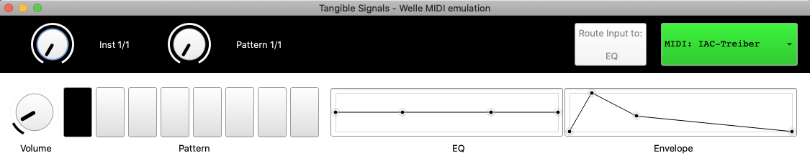

# Welle-devices-emulation
SuperCollider app that emulates physical Tangible Signals devices to test while website developement. In the app three devices are emulated (wheel, pins, string). The string device can be assigned to two sound aspects: eq and envelope.

Select midi device and receive / send midi CC messages.

The app is made standalone with [sc_osx_standalone](https://github.com/dathinaios/sc_osx_standalone) by @dathinaios

